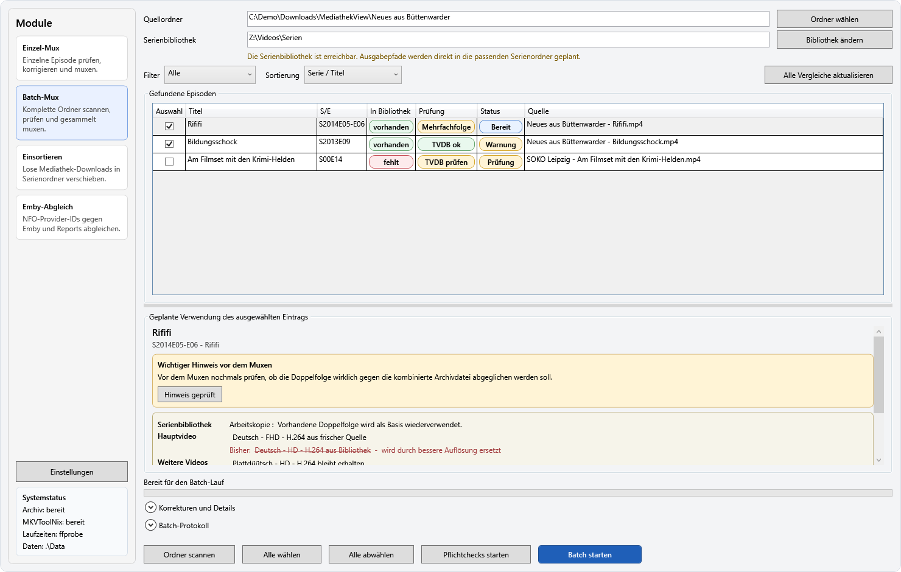
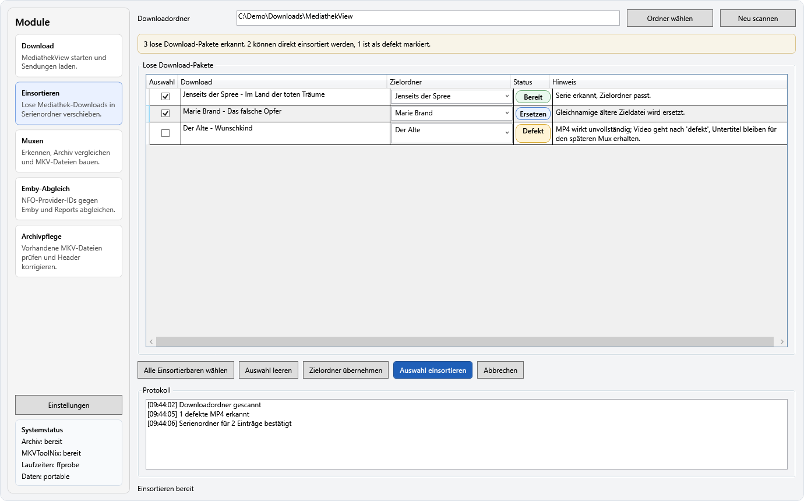
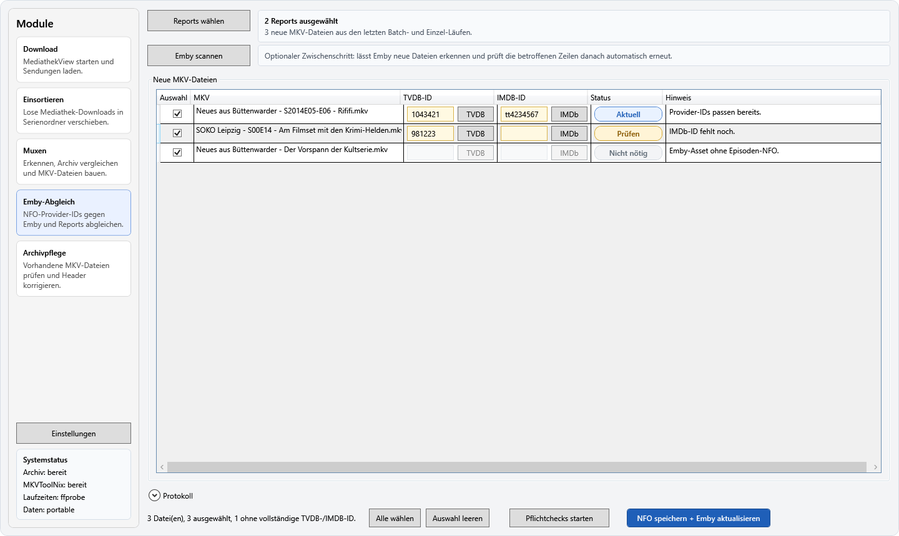

# MKVToolNix-Automatisierung

[](https://github.com/tobby88/MKVToolNix-Automatisierung/actions/workflows/ci-docs.yml)
[](https://github.com/tobby88/MKVToolNix-Automatisierung/releases/download/nightly/MkvToolnixAutomatisierung-nightly-win-x64.exe)
[](https://github.com/tobby88/MKVToolNix-Automatisierung/releases/latest)
[](LICENSE.md)

## Wichtiger Hinweis

Dieses Projekt wurde vollständig KI-gestützt erstellt und weiterentwickelt.  
Verantwortlich für Konzeption, Code-Erstellung, Überarbeitungen und große Teile der Dokumentation ist die KI, nicht ein klassisch manuell entwickeltes Teamprojekt.

## Worum es geht

Diese Anwendung automatisiert wiederkehrende Muxing-Abläufe für Serienepisoden aus Mediathek-Downloads.  
Sie ist dafür gedacht, frische Download-Dateien nicht jedes Mal manuell in MKVToolNix zusammenzuklicken, sondern die fachlichen Entscheidungen möglichst weit vorab zu treffen und dann reproduzierbar auszuführen.

Dabei geht es nicht nur um ein simples "Datei A plus Untertitel B muxen", sondern um den typischen Serien-Alltag:

- eine einzelne Episode schnell prüfen und muxen
- einen ganzen Download-Ordner gesammelt verarbeiten
- vorhandene Dateien in der Serienbibliothek erkennen und sinnvoll weiterverwenden
- neue, bessere oder zusätzliche Spuren ergänzen, ohne gute vorhandene Inhalte blind wegzuwerfen
- Audiodeskription, Untertitel und TXT-Begleitdateien konsistent mitziehen
- Tracknamen vereinheitlichen, damit die Bibliothek über längere Zeit sauber bleibt

Die App ist bewusst auf einen konkreten persönlichen Workflow zugeschnitten. Sie will nicht jede denkbare MKV-Konstellation generisch erschlagen, sondern Serienepisoden aus deutsch geprägten Mediathek-Quellen zuverlässig und mit möglichst wenig manuellem Nacharbeiten verarbeiten.

## Module

- `Einzel-Mux`: für einen einzelnen Fall mit Vorschau, manueller Korrektur und anschließendem Mux
- `Batch-Mux`: für einen kompletten Ordner mit Scan, Pflichtchecks, Ausführung, Cleanup und Protokoll
- `Einsortieren`: für lose MediathekView-Dateien, die anhand erkannter Serienordner in Unterordner verschoben werden sollen
- `Emby-Abgleich`: für neu erzeugte MKV-Dateien, deren NFO-Provider-IDs mit Emby abgeglichen werden sollen

## Screenshots

### Batch-Mux



### Einsortieren



### Emby-Abgleich



## Voraussetzungen

- Die veröffentlichte `.exe` benötigt die `.NET 10 Desktop Runtime`; für Builds aus dem Quellcode wird das `.NET 10 SDK` benötigt.
- `mkvmerge.exe` aus MKVToolNix ist für das eigentliche Muxing erforderlich.
- `ffprobe.exe` ist optional. Wenn `ffprobe` fehlt, nutzt die App für Laufzeiten den Windows-Fallback.
- Ein TVDB-API-Key ist optional. Er wird nur benötigt, wenn Serien- und Episodendaten über TVDB geprüft oder verbessert werden sollen.
- Ein Emby-API-Key ist optional. Er wird nur für den nachgelagerten `Emby-Abgleich` benötigt.

## Portable Modus

Die App ist bewusst portabel gedacht und nicht für eine klassische Installation vorgesehen.

- Es gibt keinen Installer.
- Einstellungen werden lokal unter `.\Data\settings.json` neben der Anwendung gespeichert.
- Verwendete Unterordner für portable Laufzeitdaten sind `.\Data` und `.\Logs`.
- Bei Single-File-Releases legt die App eine fehlende `README.md` beim Start neben der `.exe` an.
- Der Anwendungsordner muss beschreibbar sein.
- Die App sollte deshalb nicht aus `C:\Program Files` gestartet werden.

## Erststart

1. App starten.
2. Über `Einstellungen` die selten geänderten Dinge zentral hinterlegen:
   - Standard-Archivpfad
   - MKVToolNix-Ordner
   - optional `ffprobe.exe`
   - optional TVDB-API-Key und PIN
   - optional Emby-Server und API-Key
3. Im Hauptfenster darunter kurz prüfen, ob `Archiv`, `MKVToolNix` und die Laufzeitermittlung als bereit angezeigt werden.
4. Danach mit `Einzel-Mux`, `Batch-Mux`, `Einsortieren` oder `Emby-Abgleich` arbeiten.

## Typischer Workflow: Einzel-Mux

1. `Hauptvideo wählen`.
2. Automatische Erkennung für Quelle, Begleitdateien und Metadaten prüfen.
3. Falls angezeigt, `Quelle prüfen / freigeben` und/oder `TVDB prüfen`.
4. Bei Bedarf im Bereich `Korrekturen und Ausgabe` manuell nachbessern.
5. `Vorschau erzeugen`, um den geplanten `mkvmerge`-Aufruf zu kontrollieren.
6. `Muxen`, um die MKV tatsächlich zu erstellen.

## Typischer Workflow: Batch-Mux

1. Quellordner wählen.
2. Scan abwarten und gefundene Episoden prüfen.
3. Bei Bedarf Einträge auswählen oder abwählen.
4. Offene Pflichtprüfungen mit `Pflichtchecks starten` oder einzeln im Detailbereich erledigen.
5. `Batch starten`.
6. Danach Protokoll, neue Bibliotheksdateien und den optionalen `done`-Ordner prüfen.

Nach jedem Batch-Lauf:

- bleibt das Batch-Protokoll in der GUI sichtbar
- wird das vollständige Protokoll zusätzlich unter `.\Logs` gespeichert
- wird dort auch eine TXT-Liste neu erzeugter Ausgabedateien gespeichert, damit sie anschließend schnell geprüft werden können
- wird zusätzlich ein strukturierter JSON-Metadatenreport `Neu erzeugte Ausgabedateien - ...metadata.json` geschrieben, den das Tool für den Emby-Abgleich importieren kann

## Typischer Workflow: Einsortieren

1. MediathekView-Downloadordner wählen oder den vorgeschlagenen Standardordner nutzen.
2. `Neu scannen`, um lose Dateien in der Wurzel zu gruppieren.
3. Zielordner und Hinweise prüfen.
4. Bei Bedarf Zielordner manuell korrigieren oder einzelne Einträge abwählen.
5. `Auswahl einsortieren`, um die Dateien in die Serienunterordner zu verschieben.

## Typischer Workflow: Emby-Abgleich

1. Emby-Zugangsdaten zentral über `Einstellungen` hinterlegen.
2. Den nach einem Batch- oder Einzel-Lauf erzeugten Metadatenreport `Neu erzeugte Ausgabedateien - ...metadata.json` laden.
3. Nach `Reports wählen` prüft das Tool automatisch lokale `.nfo`-Dateien und, falls konfiguriert, auch bereits sichtbare Emby-Einträge.
4. Wenn Emby neue Dateien noch nicht kennt, `Emby scannen` ausführen und den Serverfortschritt abwarten. Danach prüft das Tool die betroffenen Einträge erneut automatisch.
5. Fehlende oder falsche TVDB-IDs bei Bedarf je Zeile über den `TVDB`-Button korrigieren.
6. Fehlende oder falsche IMDB-IDs bei Bedarf je Zeile über den `IMDb`-Button ergänzen oder korrigieren.
7. `NFO-Sync`, um geänderte TVDB-/IMDB-IDs in die `.nfo` zurückzuschreiben und nur betroffene Emby-Einträge gezielt zu refreshen.

Die erste Emby-Ausbaustufe erzeugt bewusst keine neue NFO aus dem Nichts. Emby soll die Episoden-NFO zunächst selbst anlegen; das Tool ergänzt danach nur die Provider-IDs.

## Unterstützte Dateien

Im aktuellen Serien-Modul werden verwendet:

- Hauptvideo: `.mp4`
- optionale Audiodeskription: `.mp4`
- optionale Untertitel: `.srt`, `.ass`, `.vtt`
- optionale TXT-Begleitdatei: `.txt`

`.ttml` wird nicht gemuxt, aber als Begleitdatei für Cleanup und Aufräumen berücksichtigt.

## Fachliche Regeln

Dieser Abschnitt beschreibt bewusst die wichtigsten fachlichen Entscheidungen der App. Er ist nicht als exakte technische Spezifikation gedacht, sondern als gut lesbare Zusammenfassung dessen, was das Tool normalerweise tut und warum.

### Videoauswahl

- Es werden nur Quellen derselben Episode gemeinsam betrachtet.
- Bei unterschiedlichen Laufzeiten bleibt nur die fachlich passende Laufzeitgruppe übrig. Kleinere Abweichungen werden toleriert, klar unpassende Dateien fliegen heraus.
- Frische Videospuren werden pro Sprach-/Codec-Slot ausgewählt. Das bedeutet: Für `Deutsch + H.264`, `Deutsch + H.265`, `Plattdeutsch + H.264` oder `English + H.264` bleibt jeweils nur die beste Quelle übrig.
- Innerhalb eines Slots gewinnt zuerst die höhere Auflösung, dann die größere Datei und danach die Sender-Priorität.
- Die Ausgabereihenfolge der Videospuren ist sprachlich bewusst fest: `Deutsch`, `Plattdüütsch`, `English`.
- Innerhalb derselben Sprache steht `H.264` vor `H.265`.
- Wenn zu einer Sprache sowohl `H.264` als auch `H.265` vorhanden sind, können beide erhalten bleiben. `H.265` ersetzt also nicht pauschal `H.264`.
- Im Archivabgleich kann eine vorhandene Videospur desselben Slots durch eine neue ersetzt werden, wenn die neue fachlich besser ist, insbesondere bei höherer Auflösung.

### Audio und Audiodeskription

- Normale Audiospuren aus frischen Quellen bleiben erhalten und werden nicht mehr auf die erste Tonspur reduziert.
- Audiodeskriptionsspuren werden getrennt behandelt und sollen nicht als normale Tonspur im Set landen.
- Als AD gelten Spuren mit passendem Accessibility-Flag oder mit klaren Hinweisen wie `sehbehinder...` oder `audiodeskrip...` im Namen.
- Falls die Heuristik bei einer frischen Quelldatei ausnahmsweise jede Audiospur als AD einordnen würde, bleibt die Auswahl konservativ und lässt die Audiospur lieber stehen, statt die Quelle stumm zu planen.
- Beim Ersetzen einer vorhandenen Archiv-Hauptquelle bleiben vorhandene normale Archiv-Audiospuren für Sprachen erhalten, die in den frischen ausgewählten Quellen nicht mehr abgedeckt sind.
- Eine separate AD-Datei wird weiterhin als eigener Sonderfall behandelt.

### Untertitel

- Unterstützt werden externe `.ass`, `.srt` und `.vtt`.
- Externe Untertitel werden derzeit konservativ als `hörgeschädigte` behandelt, solange nichts Sicheres erkannt wird.
- Bereits eingebettete Untertitel aus der Zieldatei werden weiterverwendet, wenn sie denselben fachlichen Slot bereits belegen.
- Für die Wiederverwendung zählt dabei bewusst nur `Typ + Sprache`, nicht jede Feinheit der Accessibility-Markierung.
- Externe Untertitel werden nur dann zusätzlich aufgenommen, wenn dieser Slot in der Zieldatei noch nicht vorhanden ist.
- Nicht unterstützte Untertitelcodecs werden nicht stillschweigend als vollwertig weitergemuxte Standard-Untertitel behandelt.

### TXT-Begleitdateien und eingebettete TXT-Anhänge

- Zu jeder tatsächlich verwendeten frischen Videodatei wird die passende benachbarte `.txt` mitgenommen.
- Ungenutzte frische Hauptquellen ziehen ihre TXT nicht mehr versehentlich mit.
- Manuell ausgewählte TXT-Anhänge bleiben davon unabhängig erhalten.
- Bereits in der Ziel-MKV eingebettete TXT-Anhänge werden konservativ behandelt und möglichst nicht unnötig verworfen.
- Für eingebettete TXT-Anhänge nutzt die App eine Heuristik aus Dateiname und Inhalt, insbesondere aus `Titel` und `URL`.
- Daraus können Sprache, Auflösung und teils auch Codec abgeleitet werden, zum Beispiel `Plattdüütsch`, `FHD`, `HD`, `H.264` oder `H.265`.
- Ein eingebetteter TXT-Anhang wird nur dann automatisch entfernt, wenn seine Zuordnung zu einer ersetzten alten Videospur wirklich eindeutig ist.
- Wenn die Zuordnung nicht sicher ist, bleibt der TXT-Anhang erhalten.
- Zusätzlich bleibt der alte explizit sichere Fallback aktiv: `genau eine vorhandene Videospur + genau eine TXT`, wenn diese Videospur ersetzt wird.

### Sender-Priorität und manuelle Prüfung

- Die Sender-Priorität ist nur ein Tie-Breaker, nicht das Hauptkriterium.
- Bevorzugt werden aktuell vor allem `ZDF`, danach `ARD` / `Das Erste`, dann `RBB` und `Arte`.
- `SRF` wird nicht pauschal verworfen, aber bewusst zurückhaltender behandelt und in der Regel zur manuellen Prüfung markiert.

### Tracknamen

Die App setzt Tracknamen bewusst einheitlich, damit die Bibliothek langfristig lesbar bleibt.

Typische Formate sind:

- Video: `Deutsch - FHD - H.264`
- Audio: `Deutsch - AAC`
- Audiodeskription: `Deutsch (sehbehinderte) - AAC`
- Untertitel: `Deutsch (hörgeschädigte) - SRT`

Sprachbezeichnungen werden in ihrer eigenen Sprache geschrieben:

- `Deutsch`
- `Plattdüütsch`
- `English`

## Hinweise für die Nutzung

- `mkvmerge.exe` wird automatisch im neuesten Ordner `%USERPROFILE%\Downloads\mkvtoolnix-64-bit-*\mkvtoolnix` gesucht.
- Der Startordner für Videoquellen bevorzugt `Downloads\MediathekView-latest-win\Downloads`, fällt aber automatisch auf `Dokumente` zurück, wenn der Ordner nicht existiert.
- Die Standard-Serienbibliothek, Toolpfade und API-Schlüssel werden zentral im Einstellungsdialog gepflegt und lokal in `.\Data\settings.json` gespeichert.
- Portable Daten und Logs bleiben im Anwendungsordner.

## Starten

```powershell
dotnet build
dotnet run
```

im Projektordner:

`<dein-projektordner>\mkvtoolnix-Automatisierung`

## Entwicklerdokumentation

Das Projekt ist zusätzlich mit XML-Dokumentationskommentaren und einer DocFX-Konfiguration versehen.

Lokal erzeugen:

```powershell
dotnet tool restore
.\scripts\build-docs.ps1
```

Lokale Vorschau im Browser:

```powershell
.\scripts\build-docs.ps1 -Serve
```

Das Skript bereinigt vorher alte generierte Artefakte unter `.\docs\api` und `.\docs\_site`, damit lokal keine veralteten DocFX-Seiten liegen bleiben.  
Die erzeugte Seite landet unter `.\docs\_site`.  
Auf GitHub ist außerdem ein Workflow unter `.github/workflows/ci-docs.yml` vorbereitet, der Build, Unit-Tests, Integrationstests und den DocFX-Site-Build automatisiert ausführt und die Dokumentation bei Pushes auf `master` optional nach GitHub Pages deployen kann.

Zusätzlich hält `.github/dependabot.yml` Versionsupdates für GitHub Actions und NuGet-Pakete automatisch im Blick.

README-Screenshots neu erzeugen:

```powershell
.\scripts\generate-readme-screenshots.ps1
```

Die PNGs landen danach unter `.\docs\images\readme\`.

### Releases

Gelegentliche Releases laufen manuell über `.github/workflows/release.yml`. Der Workflow baut in `Release`, führt Tests seriell aus, erzeugt ein Git-Tag und veröffentlicht eine framework-dependent Single-File-Exe für `win-x64` auf GitHub.

Lokal kann derselbe Release-Typ mit `.\scripts\publish-release.ps1 -Version 1.4.0` gebaut werden. Die erzeugte `.exe` liegt danach unter `.\artifacts\release\` und benötigt auf dem Zielsystem die passende `.NET Desktop Runtime 10`; `mkvmerge.exe` und optional `ffprobe.exe` bleiben separate Werkzeuge.

Zusätzlich kann `.github/workflows/nightly.yml` einen rollenden Vorabstand `nightly` erzeugen. Der Nightly-Build läuft geplant einmal pro Nacht oder manuell per `workflow_dispatch`, verwendet denselben framework-dependent Single-File-Build wie ein Release und aktualisiert das GitHub-Prerelease nur dann automatisch, wenn seit dem letzten Nightly neue Commits auf `master` dazugekommen sind.

Praktische Links:

- direkte Nightly-Exe: [MkvToolnixAutomatisierung-nightly-win-x64.exe](https://github.com/tobby88/MKVToolNix-Automatisierung/releases/download/nightly/MkvToolnixAutomatisierung-nightly-win-x64.exe)
- Nightly-Prerelease-Seite: [releases/tag/nightly](https://github.com/tobby88/MKVToolNix-Automatisierung/releases/tag/nightly)
- Nightly-Workflow-Historie: [actions/workflows/nightly.yml](https://github.com/tobby88/MKVToolNix-Automatisierung/actions/workflows/nightly.yml)

## Projektaufbau

- `MainWindow.xaml`: Shell mit Modulnavigation und Tool-Status
- `ViewModels/MainWindowViewModel.cs`: Shell-ViewModel
- `Composition/`: Composition-Root und fachlich getrennte DI-Registrierungsmodule
- `Views/`: WPF-Views für die einzelnen Module
- `ViewModels/Modules/`: ViewModels der einzelnen Module
- `Services/`: technische Dienste wie Dialoge, Toolsuche und Prozessausführung
- `Services/Emby/`: Emby-API-Zugriff, NFO-Provider-ID-Abgleich und Emby-Settings
- `Services/AppModuleServices.cs`: kleinere Service-Bundles für Einzelmodus, Batch und Shell statt eines globalen Sammelobjekts
- `Modules/SeriesEpisodeMux/`: Fachlogik für Erkennung, Planung, Archivabgleich und Muxing

Die App verwendet `Microsoft.Extensions.DependencyInjection`, bleibt aber bewusst bei einem klaren Composition Root. `IServiceProvider` wird nicht durch die Fachlogik gereicht; aufgelöst wird nur zentral beim App-Start.

## Weitergabe und Lizenz

Dieses Repository steht unter `CC BY-NC-SA 4.0`, siehe [LICENSE.md](LICENSE.md).

Praktisch bedeutet das:

- Nutzung und Weitergabe sind erlaubt
- kommerzielle Nutzung ist nicht erlaubt
- geänderte und weitergegebene Fassungen müssen wieder unter derselben Lizenz stehen
- der ursprüngliche Autor muss genannt bleiben

Wichtig:

- Creative Commons empfiehlt diese Lizenzfamilie selbst nicht für Software. Sie wurde hier trotzdem bewusst gewählt, weil sie die gewünschten Bedingungen für dieses Repository am besten abbildet.
- Dieses Projekt ist wegen der `NC`-Klausel nicht als klassische Open-Source-Lizenz im OSI-Sinne zu verstehen.
