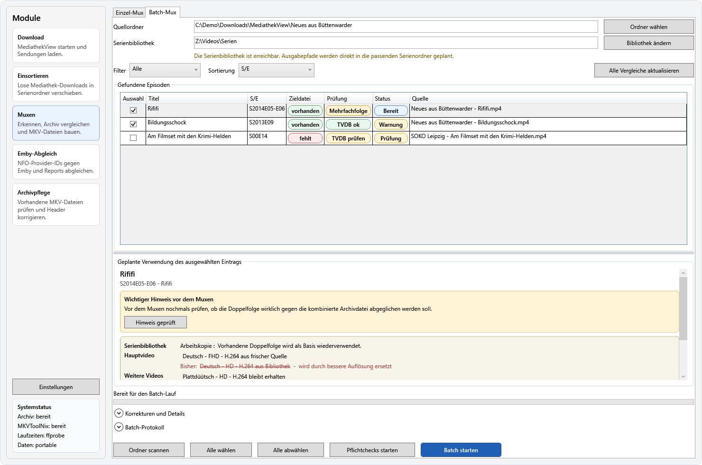
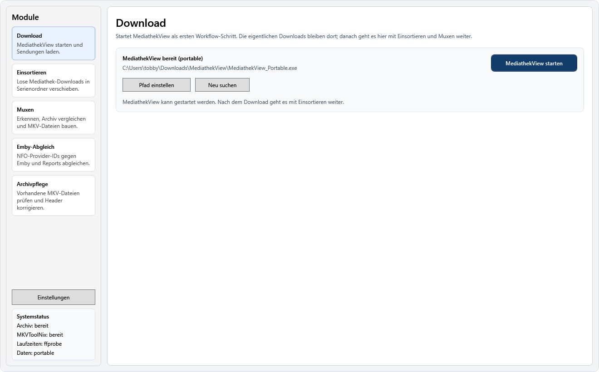
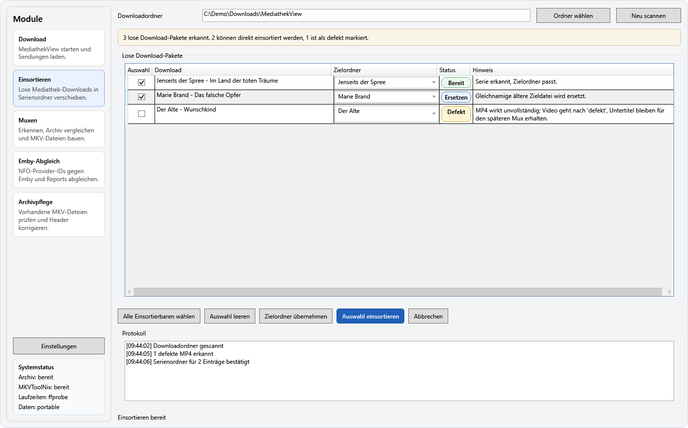
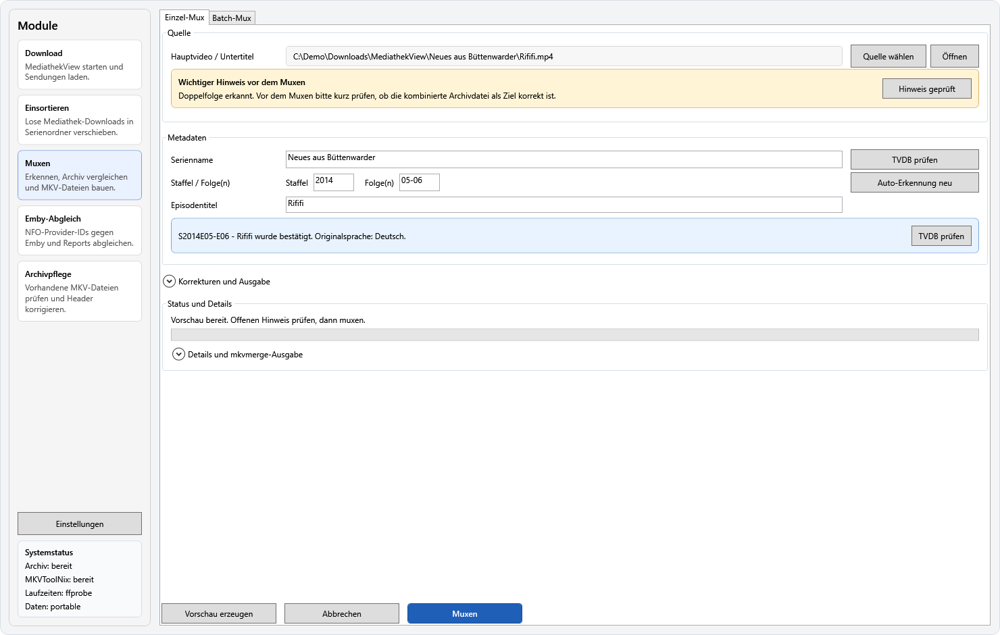
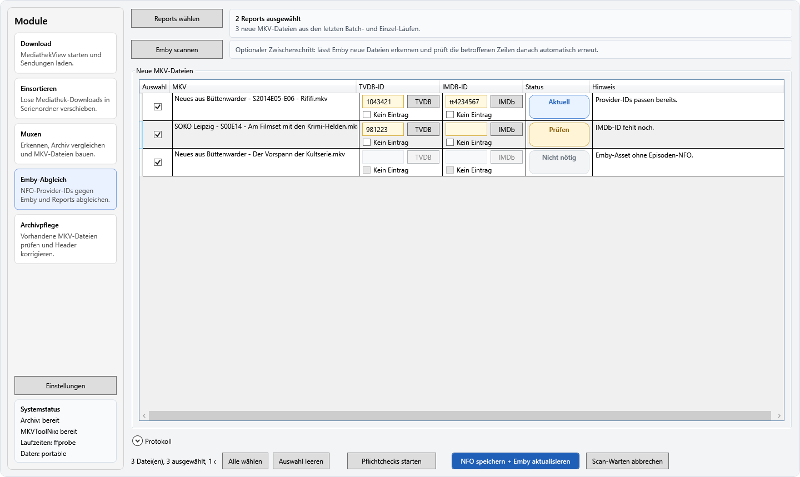
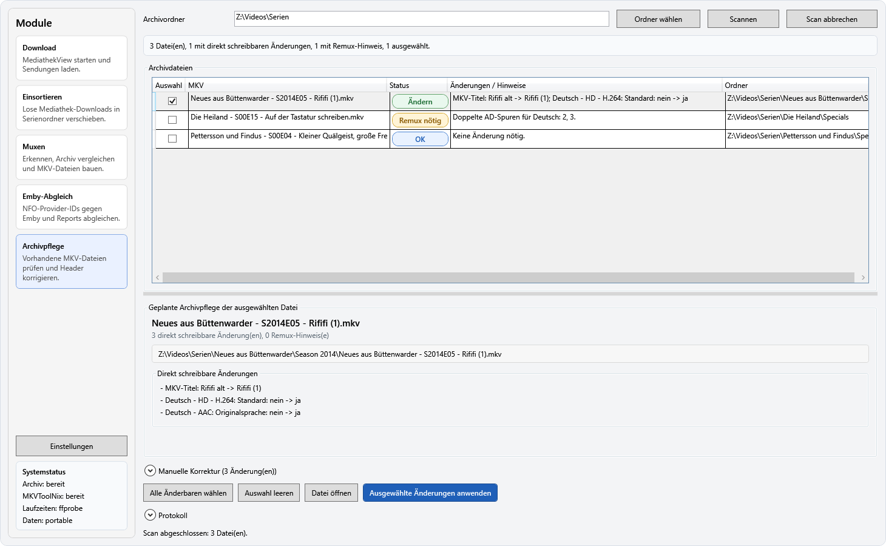
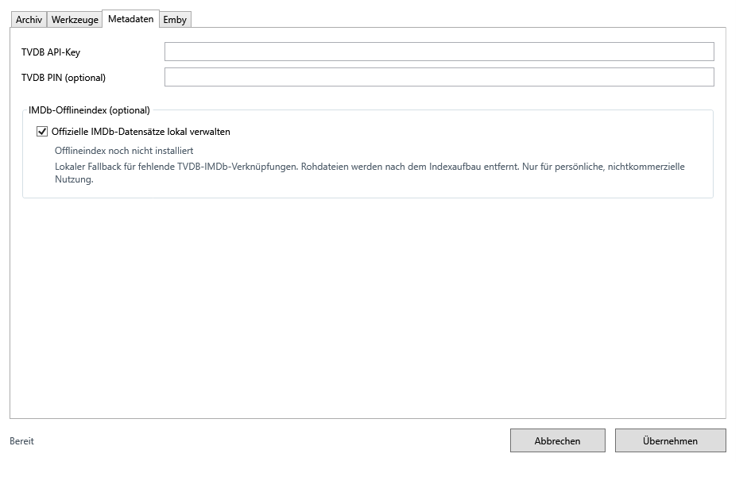

# MKVToolNix-Automatisierung

Eine portable Windows-App, die Serienaufnahmen aus Mediatheken zu übersichtlichen MKV-Dateien zusammenführt: Video, Ton, Audiodeskription und Untertitel, ohne erneute Videokodierung. Bereits vorhandene Archivdateien werden verglichen, damit bessere Quellen alte Spuren ersetzen und zusätzliche Inhalte ergänzt werden können.

Das Projekt ist auf deutschsprachige Mediathek-Downloads und ein eigenes Serienarchiv zugeschnitten, nicht als universeller Videoeditor gedacht. Emby ist eine optionale Ergänzung.

## Download und erster Start

1. Die EXE aus dem [aktuellen Release](https://github.com/tobby88/MKVToolNix-Automatisierung/releases/latest) herunterladen. Dort stehen auch die Änderungen zur jeweiligen Version.
2. **Windows x64 und die .NET 10 Desktop Runtime** bereitstellen. Die App selbst braucht keinen Installer.
3. Die EXE in einen beschreibbaren Ordner legen und starten, nicht unter `Program Files`. MKVToolNix und ffprobe werden automatisch heruntergeladen und anschließend aktuell gehalten; eigene Installationen lassen sich alternativ in den Einstellungen hinterlegen.
4. Unter **Einstellungen** den Serienarchivpfad festlegen. MediathekView, TVDB und Emby bei Bedarf ebenfalls konfigurieren.

Einstellungen, Protokolle und verwaltete Werkzeuge bleiben in `Data`, `Logs` und `Tools` neben der EXE. Für die Ersteinrichtung und Online-Metadaten wird eine Internetverbindung benötigt.

Zum Ausprobieren neuer Änderungen gibt es zusätzlich eine [Nightly-EXE](https://github.com/tobby88/MKVToolNix-Automatisierung/releases/download/nightly/MkvToolnixAutomatisierung-nightly-win-x64.exe). Sie ist eine Vorabversion, kein reguläres Release.

## Vom Download ins Archiv

| Modul | Wofür es da ist |
| --- | --- |
| **Download** | MediathekView starten und dort Sendungen herunterladen. Eine vorhandene Installation lässt sich verwenden; die portable Variante kann die App auch selbst herunterladen und aktualisieren. |
| **Einsortieren** | Zusammengehörige Downloads erkennen und ausgewählte Videos samt Begleitdateien in Serienordner einsortieren. Abgewählte Einträge bleiben unberührt. |
| **Muxen** | Eine Episode im **Einzel-Mux** oder einen ganzen Quellordner im **Batch-Mux** prüfen und verarbeiten. Quellen zuordnen, mit dem Archiv vergleichen und MKVs erstellen oder aktualisieren. |
| **Emby-Abgleich** | Die beim Muxen erzeugten Reports laden, TVDB-/IMDb-IDs prüfen und bestätigte Änderungen in vorhandene NFO-Dateien und Emby übernehmen. |
| **Archivpflege** | Bestehende MKVs prüfen und ausgewählte Titel, Dateinamen, Spurnamen und Flags korrigieren. Zugehörige NFOs und Vorschaubilder werden bei Umbenennungen mitgenommen. |

### Muxen: erst prüfen, dann schreiben

Nach der Quellenwahl zeigt **Geplante Verwendung**, welche Inhalte erhalten, ergänzt oder ersetzt werden. Unter **Korrekturen und Ausgabe** lassen sich unter anderem Metadaten, Sprachen und Ausgabeziele anpassen. Videos und Begleitdateien können zur Kontrolle geöffnet werden; markierte Pflichtchecks müssen vor dem Start erledigt sein.

Einzel- und Batch-Mux verwenden dieselben Regeln. Gute vorhandene Inhalte bleiben erhalten, wenn kein passender Ersatz vorliegt. Sind nur Titel oder Spureneigenschaften zu korrigieren, reicht eine Header-Anpassung ohne vollständiges Neumuxen.

Typische Quellen sind MP4-Videos, zusätzliche AD-Aufnahmen, Untertitel in ASS/SRT/VTT und TXT-Begleitdateien. Die Ausgabe ist MKV. Nach dem Lauf stehen Protokolle, eine Liste neuer Dateien und ein JSON-Report für den Emby-Abgleich unter `Logs` bereit. Erfolgreich verarbeitete Quellen können anschließend aufgeräumt werden.

## Metadaten und Emby

**TVDB** unterstützt die Zuordnung zu Serien und Episoden; dafür werden eigene TVDB-Zugangsdaten benötigt. **IMDb** kann über die TVDB-Verknüpfung, einen optionalen lokalen Suchindex oder browsergestützt abgeglichen werden. Unsichere Treffer lassen sich manuell auswählen; für Bonusmaterial ist auch eine bewusste Entscheidung gegen eine Provider-ID möglich.

Der **IMDb-Offlineindex** ist freiwillig. Vor Downloads fragt die App nach und zeigt vorhandenen und verfügbaren Datenstand an. Als Richtwerte gelten **rund 750 MiB Download, 1,3 GiB dauerhaft belegter Speicher und 4 bis 5 GiB freier Speicher während eines Updates** (Stand September 2026). Die Datenmengen wachsen; die automatische Verwaltung lässt sich in den Einstellungen abschalten.

Für **Emby** werden Serveradresse und API-Key hinterlegt. Liegt das Archiv auf dem Server unter einem anderen Pfad als unter Windows, muss auch diese Zuordnung in den Einstellungen stimmen. Nach dem Laden eines Mux-Reports prüft die App automatisch NFOs und Emby-Einträge. Bei noch unbekannten Dateien kann ein Scan der zugeordneten Serienbibliothek angestoßen werden.

Nach den Pflichtchecks schreibt **NFO speichern + Emby aktualisieren** nur tatsächliche Änderungen und aktualisiert die betroffenen Emby-Einträge. Emby muss die NFO zuvor angelegt haben. Teilweise bearbeitete Reports landen in `partial`, vollständig erledigte in `done`; beide lassen sich später erneut öffnen.

## Wichtig beim Arbeiten am Archiv

- **Vorschau und Pflichtchecks ernst nehmen:** Automatische Zuordnungen können falsch sein. Ähnliche Titel oder Laufzeiten garantieren keine identischen Schnittfassungen oder synchronen Tonspuren.
- **Wichtige Dateien sichern:** Muxen und Archivpflege können vorhandene Dateien ändern. Direkte Header-Änderungen erzeugen keine vollständige MKV-Sicherung.
- **Freien Speicher einplanen:** Beim Ersetzen einer MKV wird zusätzlich Platz für die neue Datei benötigt.
- **Bei Fehlern Protokoll prüfen:** Nach einem abgebrochenen Archivpflege-Schritt erneut scannen und verbleibende Änderungen prüfen. Unter **Einstellungen > Wiederherstellung** lassen sich Sicherungen und Arbeitsreste gezielt ansehen.

## Weitere Ansichten

Screenshots der übrigen Module und Einstellungen anzeigen

### Download

### Einsortieren

### Einzel-Mux

### Emby-Abgleich

### Archivpflege

### Einstellungen

## Projekt und Lizenz

Das Projekt wird für einen persönlichen Workflow KI-gestützt entwickelt. Technische Hintergründe und API-Dokumentation sind getrennt in der [Entwicklerdokumentation](docs/index.md) beschrieben.

Es gilt **CC BY-NC-SA 4.0**, siehe [Lizenz](LICENSE.md). Die optionalen [IMDb-Datensätze](https://www.imdb.com/interfaces/) sind für persönliche, nicht kommerzielle Nutzung vorgesehen. Information courtesy of IMDb ([IMDb](https://www.imdb.com)). Used with permission.
